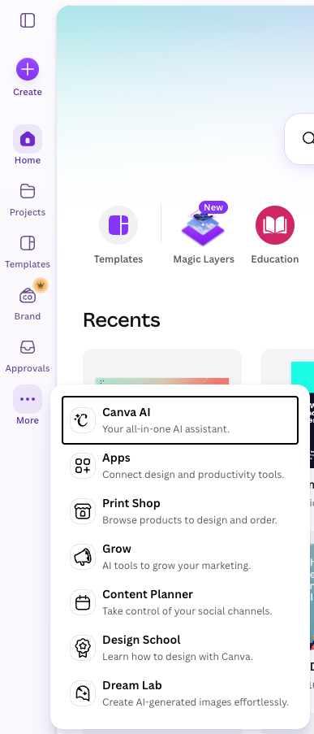
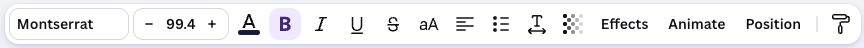

# Canva AI Mastery


This tutorial is designed to help you master Canva's AI features, enabling you to create stunning designs with ease. Whether you're a beginner or an experienced designer, this guide will provide you with the knowledge and skills needed to leverage Canva's AI tools effectively.

# Getting Familiar with Canva User Interface


Canva's user interface is intuitive and user-friendly. Here are some key components to get you started:

**Main Navigation Bar**: Located at the top of the screen, this bar provides access to various features such as templates, elements, text, and uploads.



**Design Tool Bar**: When you are working on a design, this toolbar appears on the top of the canvas, offering options to customize your design elements, including color, font, size, and alignment.



# Creating Social Media Graphics (Instagram, Facebook, LinkedIn)

Focus: Contrast, modern aesthetics, and platform-appropriate typography.

**Instagram Post for a Minimalist Skincare Brand**

```
A portrait Instagram post for a sustainable skincare brand. Use a minimalist design style with an earthy tone color palette (sage green, beige, and warm white). Features clean layout, ample white space, and a serif font for the main title to evoke a premium, calm feel.
```

---

**Facebook Event Cover for a Tech Webinar**

```
A Facebook cover for an AI and future tech webinar. Design style should be cyberpunk / futuristic, using a monochromatic color scheme of electric blues with neon purple accents. Use a bold, sans-serif geometric font for the headline to look cutting-edge.
```

---

**LinkedIn Carousels for Career Coaching Tips**

```
A corporate yet approachable LinkedIn graphic. Use a professional design style with a triadic color scheme of dark navy, mustard yellow, and crisp white. Include high-contrast text layout with a strong sans-serif font hierarchy (bold headers, clean body text).
```

---

**Instagram Story for a Fashion Flash Sale**

```
A vertical Instagram story for a streetwear fashion brand. Style: Brutalist and edgy. Use high-contrast complementary colors like electric orange and deep slate gray. Feature oversized, distressed typography and an asymmetrical layout.
```

---

**Pinterest Pin for Healthy Meal Prep Recipes**

```
A vertical Pinterest pin layout for a healthy eating blog. Style: Fresh and editorial. Use a warm analogous color palette (terracotta, soft peach, and cream). Use an elegant combination of a casual script font for keywords and a clean sans-serif for description text.
```

# Creating Marketing & Promotional Material (Flyers, Posters, Business Cards)

Focus: Visual hierarchy, mood creation, and branding basics.

**Flyer for a Local Farmers Market**

```
An A4 flyer for a community weekend farmers market. Style: Rustic and organic. Use a color palette of olive green, warm gold, and textured brown. Use a friendly, slightly rounded slab-serif font for the headers to give a welcoming, handcrafted feel.
```

---

**Poster for a Jazz Music Festival**

```
A large format concert poster for a summer jazz festival. Style: Retro mid-century modern. Use a limited palette of mustard yellow, teal, and charcoal gray with abstract geometric shapes. Typography should feature a stylized, rhythmic display font.
```

---

**Business Card for an Interior Designer**

```
A double-sided business card for a high-end interior architect. Style: Architectural minimalism. Use an achromatic color scheme (pure black, muted grays, charcoal) with a touch of gold foil effect. Feature a sophisticated lightweight sans-serif font with wide letter-spacing.
```

---

**Grand Opening Banner for a Café**

```
A landscape outdoor banner for a cozy bakery and coffee shop grand opening. Style: Scandinavian hygge. Use soft, pastel tones (blush pink, muted cream, light oak wood texture). Typography should be a mix of an elegant script font for 'Grand Opening' and clean, readable text below.
```

---

**Product Brochure Cover for an Eco-Resort**

```
A professional brochure cover for a tropical eco-resort. Style: Tropical luxury. Use deep jungle greens, warm sand beige, and accents of gold. The layout should be balanced and symmetrical, utilizing an elegant roman-style serif font for a timeless look.
```

# Creating Professional & Business Documents (Presentations, Proposals, Resumes)

Focus: Data readability, structure, and clean presentation formatting.

**Pitch Deck Presentation for a Clean-Energy Startup**

```
A 5-slide presentation deck for a renewable energy startup. Style: Clean and corporate. Use a trustworthy color scheme of deep navy blue, bright mint green, and clean white. Feature high-readability with a prominent humanist sans-serif font (like Open Sans or Calibri style) for clear data delivery.
```

---

**Project Proposal for a Creative Agency**

```
A multi-page business proposal document. Style: Art-deco inspired or contemporary chic. Use an upscale palette of emerald green, blush pink, and dark slate. Incorporate strict grid alignments and a high-contrast serif headline/sans-serif body font pairing.
```

---

**Creative Resume for a Multimedia Designer**

```
A modern one-page resume for a graphic designer portfolio. Style: Swiss typography style. Focus heavily on asymmetrical grids, a bold primary color accent (like Bauhaus red or yellow) against white and black. Use a strong, uniform neo-grotesque sans-serif font (like Helvetica style).
```

---

**Company Newsletter Header**

```
A banner header for an internal corporate tech company newsletter. Style: Flat design / corporate Memphis. Use bright, cheerful split-complementary colors (purple, orange, and light yellow) with playful geometric illustrations. Clear, bold sans-serif text.
```

---

**Annual Financial Report Cover**

```
A clean, formal report cover for a financial consulting firm. Style: Traditional corporate. Use a monochromatic blue color scheme (royal blue, sky blue, navy). Feature a center-aligned, authoritative traditional serif font (like Times or Garamond style) for a trustworthy, established appearance.
```

---

# Creating Digital Content & Web Assets (YouTube, Web Banners, Infographics)

Focus: High-impact visibility, eye-catching focal points, and storytelling layout.

**YouTube Thumbnail for a Travel Vlogger**

```
An eye-catching YouTube thumbnail about traveling in Japan. Style: Vibrant and high-energy. Use an ultra-bright color scheme featuring neon pink and deep purple gradients. Use an extra-bold, shadowed display font for the text overlay to ensure it is readable at small sizes.
```

---

**E-commerce Web Banner for Tech Accessories**

```
A landscape website hero banner for wireless headphones. Style: High-tech minimalism. Use a sleek dark mode theme (pitch black background, neon neon-green glow effects). The typography should be wide, futuristic, and all-caps sans-serif.
```

**Infographic Layout for Fitness & Nutrition Tips**

```
A vertical step-by-step infographic about daily hydration benefits. Style: Friendly and educational. Use an analogous palette of cool colors (teal, cyan, marine blue, white). Incorporate clean icon placeholders and a highly legible, uniform sans-serif font.
```

**Podcast Cover Art for a True Crime Show**

```
Square podcast cover art for a mystery and true-crime podcast. Style: Film-noir / gritty realism. Use a stark, high-contrast palette of crimson red, deep shadows, and stark white. Use a distressed, textured, or stencil serif font to create tension.
```

**E-book Cover for a Self-Help Guide**

```
A book cover template for a mindfulness and meditation guide. Style: Zen / Ethereal. Use soft, blending gradient pastel colors (lavender melting into soft sky blue). Use a delicate, centered, high-contrast serif font with ample breathing room to evoke peace and clarity.
```
